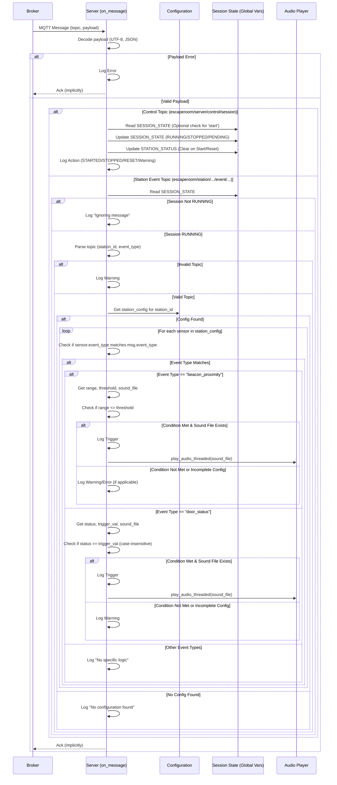

 # MQTT Message Handling Logic (`on_message`)

This document describes the logic implemented within the `on_message` callback function in `src/server.py`. This function is the central hub for processing incoming MQTT messages for the escape room server.

## Overview

The `on_message` function handles two main types of messages:

1.  **Control Messages:** These messages are sent to the `escaperoom/server/control/session` topic and manage the overall state of the escape room session (start, stop, reset).
2.  **Station Event Messages:** These messages originate from individual stations (e.g., sensors, interactive elements) and are published to topics matching the pattern `escaperoom/station/<station_id>/event/<event_type>`. These messages trigger specific actions based on the station's configuration and the current session state.

## Detailed Flow

1.  **Message Reception:** An MQTT message arrives from the broker.
2.  **Payload Decoding:**
    *   The function attempts to decode the message payload from raw bytes into a UTF-8 string.
    *   It then tries to parse this string as a JSON object.
    *   If either decoding step fails, an error is logged, and processing for that message stops.
3.  **Topic Routing:**
    *   **Control Topic (`escaperoom/server/control/session`):**
        *   The `action` field is extracted from the JSON payload.
        *   `start`: If the session is not already "RUNNING", the global `SESSION_STATE` is set to "RUNNING", the `STATION_STATUS` dictionary is cleared, and a "Session STARTED" message is logged. If already running, a warning is logged.
        *   `stop`: The `SESSION_STATE` is set to "STOPPED", and a "Session STOPPED" message is logged.
        *   `reset`: The `SESSION_STATE` is set to "PENDING", `STATION_STATUS` is cleared, and a "Session RESET" message is logged.
        *   Unknown actions trigger a warning log.
        *   Processing stops after handling a control message.
    *   **Station Event Topic (`escaperoom/station/...`):**
        *   **Session State Check:** The function first checks if `SESSION_STATE` is "RUNNING". If not, the message is ignored (with a debug log), and processing stops. This prevents station events from triggering actions when the game is not active.
        *   **Topic Parsing:** The topic string is split by `/` to extract the `station_id` and `event_type`. Errors during parsing (e.g., unexpected topic format) are logged, and processing stops.
        *   **Configuration Lookup:** The function retrieves the configuration specific to the `station_id` from the main `CONFIG` object (loaded from `config.yaml`). If no configuration exists for the station, a debug message is logged, and processing stops.
        *   **Sensor/Event Matching:** The code iterates through all sensors defined within the retrieved `station_config`. For each sensor:
            *   It checks if the `event_type` configured for that sensor matches the `event_type` extracted from the incoming message topic.
            *   **If a match is found:** The specific logic associated with that `event_type` is executed:
                *   **`beacon_proximity`:** Reads `range` from the payload and compares it to the `range_threshold` in the sensor's config. If `range <= threshold` and a `sound_on_trigger` is defined, it logs the trigger and calls `play_audio_threaded` with the specified sound file. It includes error handling for invalid numeric values and warnings for incomplete configuration/payload.
                *   **`door_status`:** Reads `status` from the payload and compares it (case-insensitively) to the `trigger_value` in the sensor's config. If they match and a `sound_on_trigger` is defined, it logs the trigger and calls `play_audio_threaded`. It includes warnings for incomplete configuration/payload.
                *   **Other `event_type`s:** If the matched `event_type` doesn't have specific handling logic (like the examples above), a debug message "No specific logic defined..." is logged.
            *   **Important Note:** The loop continues even after finding a match. If multiple sensors within the same station configuration are configured to react to the *same* `event_type`, *all* of them will be processed.

## Sequence Diagram

## State Management

*   **`SESSION_STATE` (Global Variable):** Tracks the overall game state ("PENDING", "RUNNING", "STOPPED"). Crucial for enabling/disabling station event processing.
*   **`STATION_STATUS` (Global Dictionary):** Intended to track the status of individual stations (e.g., completion). Currently, it's cleared on session start/reset but not actively updated in the provided example logic (commented out).
*   **`CONFIG` (Global Variable):** Holds the configuration loaded from `config.yaml`, defining station setups, sensor types, trigger conditions, and associated sounds. 